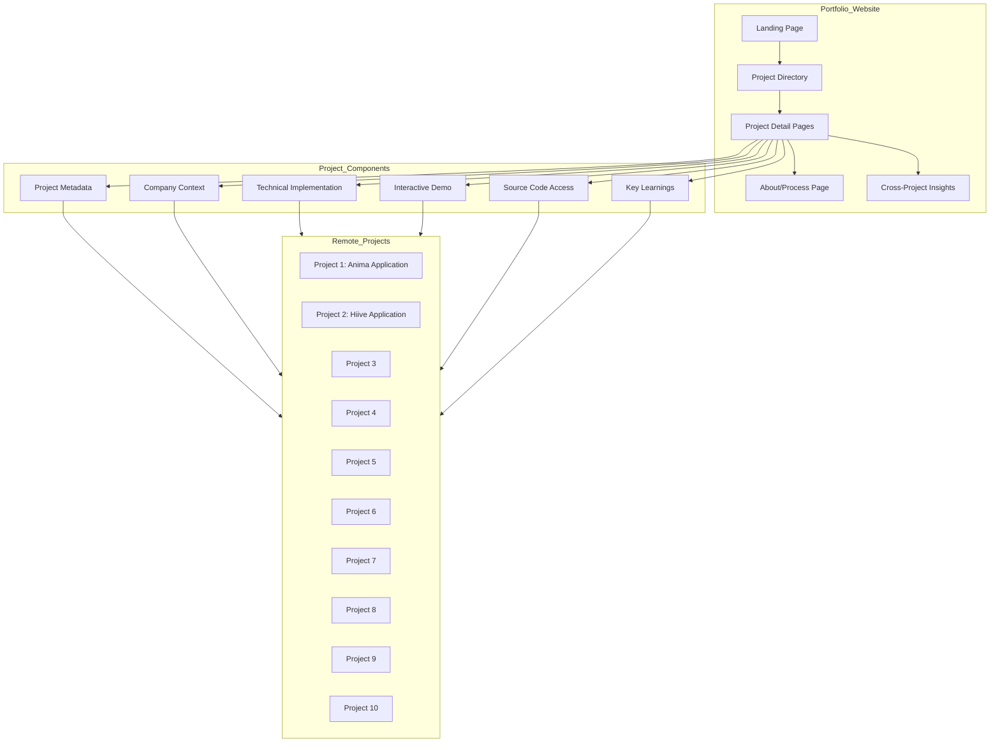

# System Patterns: 10x10 Job Application Portfolio

## System Architecture

The 10x10 Job Application Portfolio follows a modular, component-based architecture designed to showcase multiple projects while maintaining a cohesive user experience.

## Key Technical Decisions

### 1. Decoupled Project Structure

**Decision**: Maintain each project as a separate, self-contained entity with its own repository and memory bank.

**Rationale**:
- Enables independent development and deployment of each project
- Allows each project to use its own technology stack as appropriate
- Facilitates clean separation of concerns between projects
- Mirrors real-world development practices for portfolio authenticity

### 2. Unified Portfolio Interface

**Decision**: Create a central portfolio website that provides a consistent interface for browsing and exploring all projects.

**Rationale**:
- Provides a cohesive user experience despite diverse project implementations
- Enables standardized presentation of project information
- Facilitates comparison across projects
- Creates a single entry point for potential employers

### 3. Memory Bank Integration

**Decision**: Implement a memory bank system for each project and the portfolio itself.

**Rationale**:
- Ensures comprehensive documentation of each project
- Maintains context and learnings across development sessions
- Provides structured approach to capturing insights
- Creates valuable meta-content about the development process

### 4. Remote Memory Bank References

**Decision**: Use symbolic links to reference memory banks from individual projects.

**Rationale**:
- Maintains single source of truth for project documentation
- Allows portfolio to access up-to-date project information
- Avoids duplication of content
- Enables portfolio to aggregate insights across projects

### 5. Standardized Project Metadata

**Decision**: Define a consistent metadata schema for all projects.

**Rationale**:
- Enables automated generation of portfolio content
- Facilitates filtering and searching across projects
- Ensures comprehensive documentation of each project
- Provides structured data for analysis and presentation

## Design Patterns in Use

### 1. Component-Based Architecture

The portfolio website will use a component-based architecture, with reusable UI components for consistent presentation across projects.

**Key Components**:
- Project Card: Condensed project summary for the directory
- Technology Badge: Visual indicator of technologies used
- Company Context Panel: Standardized presentation of company information
- Learning Insight Card: Formatted presentation of key learnings
- Demo Container: Standardized embedding of project demos

### 2. Content Projection Pattern

The portfolio will implement a content projection pattern, pulling standardized information from each project's memory bank and presenting it in a consistent format.

**Implementation**:
- Define schema for project metadata
- Extract relevant information from project memory banks
- Transform into standardized format for portfolio
- Present through consistent UI components

### 3. Progressive Enhancement

The portfolio will implement progressive enhancement to ensure accessibility and performance across devices.

**Implementation**:
- Core content and navigation available to all users
- Enhanced interactions and animations for capable browsers
- Responsive design adapting to different screen sizes
- Optimized asset loading based on device capabilities

### 4. Insight Aggregation Pattern

The portfolio will implement an insight aggregation pattern to identify and present cross-project learnings and patterns.

**Implementation**:
- Extract key learnings from each project
- Categorize by topic, technology, or challenge type
- Identify common themes and progressive insights
- Present aggregated learnings as meta-content

## Component Relationships

### Project to Portfolio Relationship

Each project maintains its independence while contributing to the portfolio through:

1. **Metadata Contribution**: Standardized project information
2. **Memory Bank Access**: Symbolic links to project documentation
3. **Demo Integration**: Embedded or linked project demonstrations
4. **Source Access**: Links to project repositories
5. **Learning Extraction**: Structured capture of insights and learnings

### Cross-Project Analysis

The portfolio enables cross-project analysis through:

1. **Technology Comparison**: Visualization of technologies used across projects
2. **Challenge Patterns**: Identification of common challenges and solutions
3. **Learning Progression**: Tracking of skill development across projects
4. **Approach Evolution**: Documentation of how approach evolves over the 10 projects

### User Navigation Flows

The portfolio supports multiple navigation patterns:

1. **Chronological Exploration**: Browsing projects in order of creation
2. **Technology-Based Filtering**: Finding projects that use specific technologies
3. **Company-Focused View**: Exploring projects by target company
4. **Challenge-Oriented Browsing**: Discovering projects that address similar challenges

## Implementation Considerations

### 1. Portfolio Technology Selection

The portfolio website should be implemented using technologies that:
- Support component-based architecture
- Enable responsive design
- Facilitate content projection from external sources
- Provide excellent performance and SEO capabilities

Potential technology stacks include:
- React with Next.js for server-side rendering and static generation
- Vue with Nuxt.js for similar capabilities
- Svelte with SvelteKit for high performance and smaller bundle size

### 2. Project Metadata Schema

Each project should include standardized metadata:
- Project title and description
- Target company and role
- Technologies used (categorized by frontend, backend, etc.)
- Key challenges addressed
- Implementation timeframe
- Primary learnings and insights
- Links to source code, demo, and documentation

### 3. Memory Bank Integration

The portfolio should:
- Reference project memory banks through symbolic links
- Extract relevant information programmatically
- Update when project memory banks are updated
- Maintain its own memory bank for portfolio-level insights

### 4. Deployment Strategy

The portfolio should be:
- Deployed to a public hosting service
- Accessible via a custom domain
- Optimized for search engines
- Regularly updated as new projects are completed

### 5. Performance Optimization

The portfolio should implement:
- Lazy loading of project details
- Optimized image loading
- Code splitting for faster initial load
- Caching strategies for improved performance